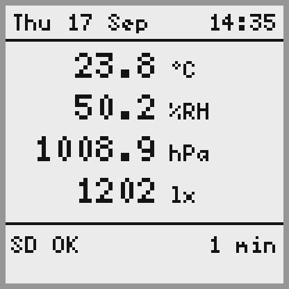
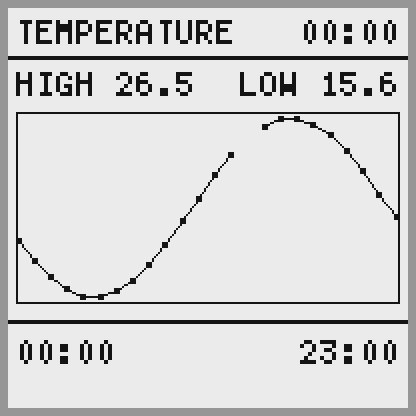
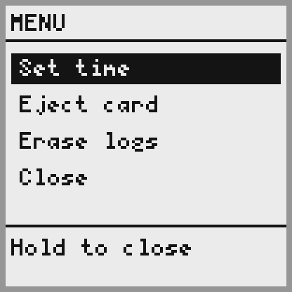
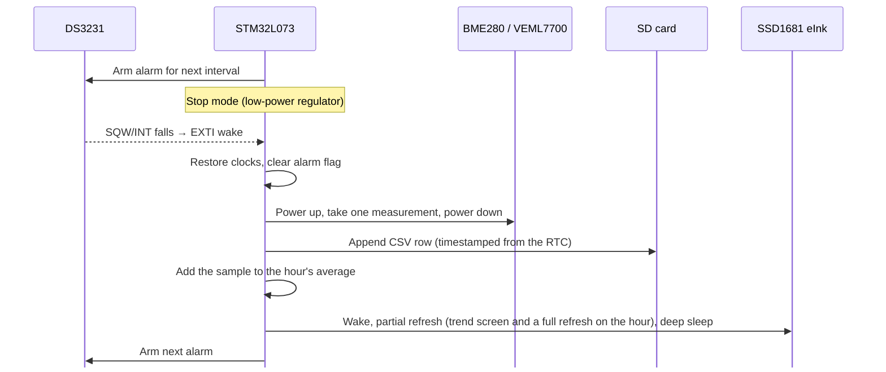

# STM32 Low-Power Environment Monitor

[](https://github.com/joe-eldridge/stm32_cpp_environment_monitor/actions/workflows/ci.yml)

A battery-oriented environment monitor and data logger for industrial settings, built on an STM32L073RZ. It spends almost all of its time in Stop mode. An external RTC wakes it on a schedule to sample temperature, pressure, humidity and light, append a timestamped row to an SD card, and go back to sleep.

The application code is written in C++17, without heap allocation, exceptions or RTTI. The sensor drivers are hardware-independent, so they are unit-tested on a host PC, and CI checks every push.

## Hardware

| Part | Role | Interface |
|---|---|---|
| NUCLEO-L073RZ (STM32L073RZ, Cortex-M0+, 192 KB flash, 20 KB RAM) | MCU | — |
| DS3231 RTC (HW-084 board) | Timekeeping and wake-up alarm | I2C `0x68`, alarm on SQW/INT |
| Bosch BME280 (Adafruit board) | Temperature, pressure, humidity | I2C `0x77` |
| Vishay VEML7700 (Adafruit board) | Ambient light | I2C `0x10` |
| Adafruit 1.54" eInk (SSD1681, 200×200, original revision) with microSD slot and SPI SRAM | Display and log storage | SPI |
| KY-040 rotary encoder with push switch | Menu control | GPIO, all three lines on EXTI |

### Pin assignments

| Signal | Pin | Notes |
|---|---|---|
| I2C1 SCL / SDA | PB8 / PB9 | Shared by the RTC and both sensors |
| DS3231 SQW/INT | PC0 | Falling-edge EXTI wakes the MCU from Stop mode; internal pull-up |
| SPI1 SCK / MISO / MOSI | PB3 / PA6 / PA7 | Shared by the SD card, eInk display and SRAM |
| SD card CS | PA10 | |
| eInk CS / D/C / RST / BUSY | PA8 / PB10 / PB4 / PB5 | |
| SRAM CS | PC7 | |
| USART2 TX / RX | PA2 / PA3 | ST-LINK virtual COM port, 9600 baud |
| Encoder CLK / DT | PC1 / PC2 | Decoded in an EXTI handler on either edge, unmasked only while the menu is open; internal pull-ups |
| Encoder switch | PC3 | Falling-edge EXTI wakes the MCU and opens the menu |
| User button B1 | PC13 | Held at reset: I2C fault-injection test (see below) |

## How it works

 

*The main screen and the trend screen, rendered on a PC by the `screen_preview` tool (see [Testing](#testing)). The break in the plot is an hour with no readings.*



*The menu. Turn to move, click to choose, hold to go back.*



- **First sample at boot:** the device samples, logs and draws the screen straight away, then sleeps until the first alarm.
- **Wake source:** DS3231 Alarm 1, matched on minutes and seconds, re-armed after every wake. The interval must divide an hour evenly, which is checked at compile time.
- **Sensors sleep between samples.** The BME280 runs in forced mode, taking one conversion on request (about 10 ms) and otherwise sleeping. The VEML7700 is held in shutdown except for the roughly 115 ms needed for one reading. The datasheets give about 0.1 µA and 0.5 µA for those sleep states, against hundreds of µA and 45 µA left running.
- **Log format:** `LOG.CSV` holds one row per wake. Values are fixed-point integers, since the Cortex-M0+ has no FPU. For example:

  ```
  Timestamp,TemperatureCentiC,PressureCentiHpa,HumidityCentiPct,LuxCenti,LuxSaturated
  2026-09-16 19:45:00,2352,101695,5054,37645,0
  ```

  A failed sensor read leaves its fields empty rather than stopping the log. The menu's "erase logs" deletes this file; cards themselves are formatted on a PC, as FAT16 or FAT32. Rebuilding a filesystem on the device would mean writing out the whole FAT, which on a 16 GB card at this bus speed takes over ten minutes (measured).
- **Trend screen:** samples are averaged by the hour, and the last 24 hourly averages are plotted against time. The screen appears on the first wake of each hour, in place of the main screen, and a full refresh is used for the change of screen.
- **Menu:** pressing the encoder's switch wakes the device and opens a menu for setting the clock, ejecting the card and erasing the logs. It closes itself after 30 seconds untouched, then the normal cycle resumes with a fresh sample.
- **Setting the time:** if the DS3231 reports that its oscillator has stopped (for example, a flat backup battery), the firmware prompts over the serial port for `YYYY-MM-DD HH:MM:SS` before starting.

## Design notes

**Driver architecture.** Sensor drivers depend on a small `I2cDevice` interface ([i2c_device.hpp](Drivers/BSP/Components/util/i2c_device.hpp)) rather than on the STM32 peripheral. On the target, `I2cBusDevice` binds a slave address to an `I2cBus` driven through ST's LL API. In tests, a fake device stands in. `HAL_GetTick` and `HAL_Delay` are linked in as seams, so timeouts and waits are deterministic on the host.

**HAL for setup, LL for the busy paths.** CubeMX-generated HAL code configures the system, while the I2C and SPI transfers use the LL API directly to keep awake time short.

**Robustness.**
- **Bounded waits:** every busy-wait is limited by a `Timeout` that stays correct when the 32-bit tick counter wraps (after about 49 days).
- **I2C bus recovery:** on a timeout, the I2C peripheral is reset. If a slave is still holding SDA low, for example after an MCU reset mid-read, the driver clocks it free and sends a STOP. The same recovery runs at every boot.
- **Card compatibility:** two details of the SPI protocol that cards differ in their tolerance of. Each command is preceded by eight idle clocks, which the specification requires between one command's response and the next command: without them a card still releasing the line misreads the command frame and answers with an R1 with half its error bits set. And initialisation runs at 262 kHz, inside the specification's 100-400 kHz window rather than merely below its ceiling. Either fault shows up as one brand of card working and another not, with nothing in between to suggest why - which is what happened here, and what the init diagnostics below were added to answer.
- **SD card swaps:** the card can be removed and reinserted while running. A failed transfer marks the card uninitialised, and the next write re-initialises and re-mounts it. This needed a workaround for ST's FatFs glue, which caches `disk_initialize()` even when it fails; see [user_diskio.c](FATFS/Target/user_diskio.c).
- **Shared SPI bus:** scope guards (RAII) always restore the bus speed and release chip-select, even on error paths. Changing the bus speed also waits for the frame in flight to finish, as the reference manual requires: clearing the enable bit part way through a byte stops the clock mid-frame and leaves the peripheral and the device it was addressing out of step. That one showed up only after the Debug build was optimised enough to close the gap between the last transfer and the speed change, and it broke the SD card and the display at once.

**Display.** The SSD1681 is kept in deep sleep (about 1 µA) between updates. `EpaperDisplay` holds two images: the canvas that screens draw on, and a copy of what the panel is currently showing. That second 5 KB costs a quarter of the MCU's RAM and earns it back twice over. A partial refresh needs the previous image as its reference, which is then simply to hand; and the two can be compared, so only the band of rows that actually differ is sent. An update that changes nothing does nothing at all - no wake, no waveform, no current.

**Making the menu responsive** was done by measuring each update in parts - drawing, waking the panel, the panel's own waveform, and the rest - and fixing whichever was largest:

| Change | What the timing showed | Menu step |
|---|---|---|
| Starting point | Sending two whole images at 1 MHz took longer than the panel's 0.6 s waveform | 2.9 s |
| Send only the rows that changed | | 1.0 s |
| DMA for image blocks | Transfers became cheap; drawing was now the largest part, at 244 ms | 0.92 s |
| Fill rectangles a byte at a time, draw glyphs as runs | The selection bar alone had been 4,224 separate pixel writes | 0.75 s |

Opening the menu also went from a full refresh to a partial one: 2.3 s to 0.76 s, with no visible ghosting. What remains is almost all the panel: 596 ms of a 745 ms step.

Two things were tried and dropped, on the same evidence. Waveshare's fast partial waveform for this panel, loaded in place of the built-in one, measured 572 ms against 596. Shortening its main phase showed why: frames are 20 ms, their waveform is 17 of them, and about 230 ms of every refresh is fixed cost around the waveform, so the "0.3 s" on the product page is the waveform alone. A shorter waveform of our own was quicker but left ghosting. And keeping the panel powered between menu steps, which would avoid that fixed cost, re-highlighted items that had already been cleared; the cause is not yet understood, so it isn't used.

The first update after boot, and any update after a failure, is promoted to a full refresh, since the panel's contents can't be trusted then.

**Screens.** Each screen is split into its content (fixed-size strings built from the readings, unit-tested exactly) and its layout (drawing those strings). Text uses the public-domain X11 5×7 bitmap font, converted to a flash table by [tools/bdf_to_font.py](tools/bdf_to_font.py) and scaled up for the large readings. Numbers are formatted with a small fixed-point formatter rather than `printf`, which would pull in a large part of the C library.

**Hourly averages.** Samples are accumulated into the hour their timestamp falls in, and an hour is closed out when a sample arrives for the next one. Periods are identified by their absolute start time rather than by counting samples, so the plot's time axis stays linear: hours the device slept through, or in which every read failed, are kept as gaps and break the line rather than being drawn as a straight segment across the missing time. A day of averages costs about 700 bytes of the 20 KB of RAM. The history starts empty after a reset; rebuilding it would mean parsing a day of CSV rows on the wake after a reset, for a plot that refills itself within a day.

**Menu.** The encoder is decoded in its interrupt rather than polled: a refresh blocks the main loop for about a second, and a detent turned during one would otherwise be lost. Both of its lines interrupt on either edge, and the handler reads the pair, since the decoder needs both levels rather than which one moved. The interrupts are unmasked only while the menu is open, so a knocked knob can't wake the device from Stop mode and spend a wake cycle on nothing.

The menu itself holds no pins and performs no actions: it turns encoder movement and button events into requests, and the application carries them out and hands back a message to show. That keeps every path through it testable on a host, including the ones that are awkward to reach by hand, such as declining to erase or abandoning a half-finished clock edit. The encoder decoding is separate again: transitions that change both lines at once cannot happen on a real turn, so they are discarded rather than guessed at, and contact bounce cancels itself out.

**Sensor accuracy.**
- **BME280:** uses Bosch's integer compensation formulas, with signed calibration values handled as in Bosch's reference driver.
- **VEML7700:** uses the 0.0672 lx/count resolution from Vishay's current application note ([84323, rev. 06-Mar-2025](https://www.vishay.com/docs/84323/designingveml7700.pdf)); the original datasheet value reads about 14% low. Readings at full scale are flagged as saturated.

## Testing

### Host unit tests

The same driver sources the firmware uses are compiled for the host and tested with GoogleTest, with AddressSanitizer and UndefinedBehaviorSanitizer enabled:

```bash
cmake -S tests -B build/tests
cmake --build build/tests
ctest --test-dir build/tests --output-on-failure
```

Coverage includes:
- the BME280 against Bosch's worked example, and against the datasheet's floating-point formulas across several calibrations,
- DS3231 alarm scheduling at interval boundaries, including the window where an alarm write could land too late,
- VEML7700 power sequencing, scaling and saturation,
- SSD1681 command sequences, refresh modes and BUSY handling, against a recording SPI fake,
- the e-paper update cycle: reference-image ordering, forced full refreshes, sleeping after failures, and that only the changed rows are sent (and nothing at all when nothing changed),
- framebuffer drawing: pixel layout, clipping, rectangles and lines in every direction,
- text rendering, number formatting (rounding, negative values, buffer limits) and day-of-week calculation,
- the main screen's content, including missing and saturated readings and the widest values,
- hourly averaging: rounding, gaps, the ring buffer filling and wrapping, midnight and month ends, and the clock being set backwards,
- the trend screen: its labels, how values map onto the plot, and that a new day of data fills from the right with gaps left unjoined,
- encoder decoding: direction, part-turns, bounce, and what happens when samples are missed,
- button debouncing, including the difference between a click and a hold,
- the menu: every screen and transition, and the clock editor's month lengths and leap years,
- SD card capacity parsing from the CSD register,
- FatFs timestamp packing,
- timeout behaviour across tick wraparound.

### Measuring on the target

Debug builds time each display update and report the panel's own waveform separately from the time spent sending images to it:

```
Menu step: shown 745ms = draw 68 + wake 35 + panel 596 + rest 46, done 769ms
```

"Shown" runs from handling the input to the image being on the panel; "done" includes anything after. An earlier version of this split, panel against everything else, is what found the SPI bug above: that time was identical for full and partial refreshes, which pointed at per-byte cost rather than anything the panel was doing. The finer split then showed drawing had become the largest cost once DMA took over the transfers.

`SdCard` records how its last initialisation went - which step it reached and how long that took - and prints it at boot. FatFs reports a card that won't mount as `FR_NOT_READY` and nothing more, so this is most of the diagnosis:

```
SD init took 145ms, reached complete
SD init took 1000ms, reached ACMD41 (still busy)
```

### Screen previews

`screen_preview` renders every screen with sample data, including an empty history and a full day of it, so layouts can be checked without flashing:

```bash
build/tests/screen_preview build/tests
tools/pbm_to_png.py build/tests/*.pbm
```

### On-target fault injection

Hold **B1** while pressing reset. The firmware bit-bangs the start of a BME280 read and stops mid-byte, leaving the sensor holding SDA low. It then resets itself, and the next boot must recover the bus:

```
B1 held - wedging I2C bus: SDA held low, resetting
I2C: SDA held low at boot - recovery succeeded
```

See [i2c_fault_injection.cpp](Core/Src/i2c_fault_injection.cpp).

### CI

[GitHub Actions](.github/workflows/ci.yml) runs the unit tests with GCC and Clang, and builds the Debug and Release firmware with the Arm GNU toolchain. The resulting `.elf` and `.map` files are saved with each run.

## Building and flashing

The project was generated with STM32CubeMX and builds with CMake and Ninja.

**VS Code:** open the folder with the STM32Cube for Visual Studio Code extension installed, select the `Debug` or `Release` preset, then build and flash through the extension.

**Command line:** with `arm-none-eabi-gcc` on your `PATH`:

```bash
cmake --preset Release
cmake --build --preset Release
```

The output is `build/Release/stm32_cpp_environment_monitor.elf`. Open the ST-LINK virtual COM port at 9600 baud to see diagnostics.

## Project layout

```
Core/                     Application (app.cpp), the screens and the menu, hourly averaging,
                          CubeMX init code, fault-injection hook
Drivers/BSP/Components/   Project drivers: bme280, ds3231, veml7700, sdcard, display (SSD1681),
                          graphics (framebuffer, font, text), input (encoder, button),
                          util (buses, pins, timing)
Drivers/CMSIS, Drivers/STM32L0xx_HAL_Driver   ST vendor code
FATFS/, Middlewares/      FatFs and its glue to the SD card driver
tests/                    Host unit tests, fakes and the screen preview tool
tools/                    Font generator and preview image converter
docs/images/              README images
.github/workflows/        CI
```

## Status and roadmap

- [x] Stop-mode sleep with RTC alarm wake
- [x] BME280, VEML7700 and DS3231 drivers with host unit tests
- [x] SD card logging with removal and reinsertion recovery
- [x] I2C bus recovery with on-target fault injection
- [x] CI: unit tests and firmware builds
- [x] SSD1681 eInk driver with full and partial refresh
- [x] Main screen: current readings, update time and SD status
- [x] Hourly averages and a 24-hour trend plot
- [x] Button menu: set the clock, eject the card, erase the logs
- [ ] Current-consumption measurements and battery-life estimate
- [ ] Production wake interval: currently 1 minute for testing, with 5 minutes planned
- [ ] Hardware changes to the HW-084 RTC board (power LED, charging circuit)

## License

Project code is released under the [MIT License](LICENSE). Third-party code keeps its own licence: ST's HAL and CMSIS files include theirs in their folders, and FatFs's is in its source file headers.
